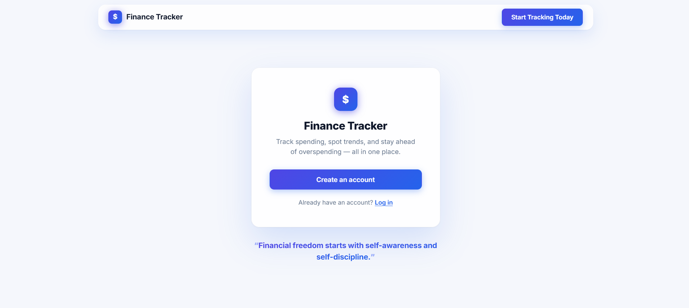
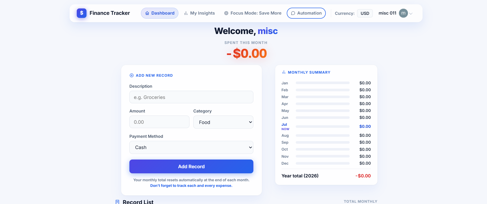
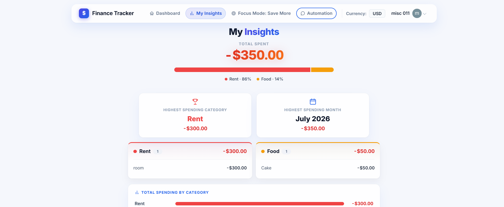
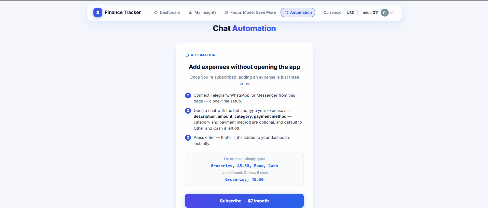

<div align="center">
  

  # Finance Tracker

  A personal finance tracker you can also update by just texting it —
  log an expense from Telegram without ever opening the app.

  [](https://financetracker.blog)

  
  
  
  
  
  
</div>

<br />

## What it is

Finance Tracker is a MERN-stack web app for keeping track of day-to-day
spending: log expenses, see where the money actually goes, set a savings
goal tied to a real salary, and get warned by email before overspending.
It also supports adding expenses hands-free straight from a chat app —
no need to open the app at all.

**Live app:** [financetracker.blog](https://financetracker.blog)

<br />

## Screenshots

<p align="center">
  
</p>

<table>
  <tr>
    <td width="50%"></td>
    <td width="50%"></td>
  </tr>
  <tr>
    <td align="center"><sub><b>Dashboard</b></sub></td>
    <td align="center"><sub><b>Insights</b></sub></td>
  </tr>
  <tr>
    <td width="50%"></td>
    <td width="50%"></td>
  </tr>
  <tr>
    <td align="center"><sub><b>Save More — salary & spending alerts</b></sub></td>
    <td align="center"><sub><b>Chat Automation — Telegram</b></sub></td>
  </tr>
</table>

> Drop your own screenshots into `docs/screenshots/` using the filenames above
> (`landing.png`, `dashboard.png`, `insights.png`, `save-more.png`, `automation.png`)
> and they'll render here automatically.

<br />

## Features

**Expense tracking**
- Add, inline-edit, and delete records — description, amount, category, payment method
- Multi-currency display, switchable at any time
- Monthly totals reset automatically each month, full history preserved

**Insights**
- Spending broken down by category with a visual composition chart
- Monthly breakdown table, highest-spending category and month at a glance

**Savings goals & spending alerts**
- Set a monthly salary and track what share of it has been spent
- Salary is encrypted at rest (AES-256-GCM) — not readable directly from the database, even by an admin
- Automatic email alerts at 30% and 50% of salary spent
- A monthly recap email itemizing every transaction, sent automatically

**Chat automation** — $2/month
- Add expenses by messaging a bot: `Groceries, 45.50, Food, Cash`
- Category and payment method are optional, defaulting to Other/Cash
- WhatsApp and Messenger support built and ready, pending Meta business approval
- Subscription billing and cancellation handled through Stripe

**Auth & security**
- Sign in with Google or Facebook via Clerk
- Field-level encryption for sensitive financial data
- Verified sending domain for all outbound email

<br />

## Tech stack

| | |
|---|---|
| **Frontend** | React 19 · TypeScript · Vite · React Router |
| **Backend** | Express · TypeScript · MongoDB / Mongoose |
| **Auth** | Clerk (Google & Facebook OAuth) |
| **Payments** | Stripe (subscriptions + webhooks) |
| **Email** | Resend |
| **Chat automation** | Telegraf (Telegram Bot API), Meta Cloud API (WhatsApp / Messenger) |
| **Hosting** | Vercel — frontend and backend both deployed as serverless functions |

<br />

## Project structure

```
finance_tracker/
├── backend/
│   ├── api/              Vercel serverless entry point
│   └── src/
│       ├── controllers/
│       ├── model/
│       ├── routes/
│       └── utils/
└── frontend/
    └── finance_tracker/   React app (Vite)
        └── src/
            ├── Pages/
            ├── components/
            └── context/
```

<br />

## Running locally

**Backend**
```bash
cd backend
npm install
cp .env.example .env   # fill in your own values — see comments in the file
npm run dev
```

**Frontend**
```bash
cd frontend/finance_tracker
npm install
cp .env.example .env   # fill in your own values
npm run dev
```

Each `.env.example` lists every required variable with a comment on where to get it.
